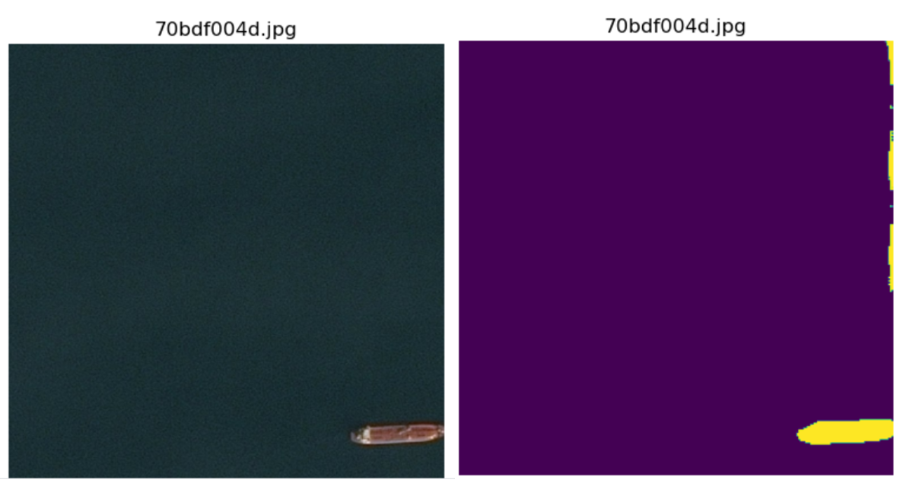

# airbus_ship_detection
## Project Description
Deep Learning models for detecting ships in satellite images [Kaggle Airbus Competition](https://www.kaggle.com/c/airbus-ship-detection). 

## Dataset
The dataset used consisted of a set of images for training and testing, as well as a .csv file that contained rle-encoded strings for the training masks.
The dataset was imbalanced, so the following was performed during image preprocessing:
* Delete damaged photos with size < 50 kb
* Resize images from 768x768 to 256x256 (optional step)
* Stratified sampling (2000 pictures for each number of depicted ships)

## Project structure
```
├── img                <- Image used in the readme
├── .gitignore
├── requirements.txt   <- The requirements file for reproducing the analysis environment, e.g.        
├── README.md 
├── setup.py           <- Make this project pip installable with `pip install -e`
├── notebooks
│   └── exploratory_data_analysis.ipynb   <- EDA
├── src
│   ├── image_segmentation
│   │   ├── assets
│   │   │   ├── data  
│   │   │   │   ├── test_v2          <- Folder with test images
│   │   │   │   ├── train_v2         <- Folder with train images
│   │   │   │   ├── results.csv      <- File with results
│   │   │   │   ├── train_ship_segmentations_v2.csv    <- File with encoded masks  for training set
│   │   │   ├── model
│   │   │   │   ├── model.h5
│   │   │   │   ├── model_weight.h5
│   │   ├── model
│   │   │   ├── unet.py            <- Scriots to build and fit model
│   │   ├── utils
│   │   │   ├── dataset.py         <- Scripts to load and preproccess data
│   │   │   ├── generators.py      <- Scripts to generate data
│   │   │   ├── metrics.py         <- Scripts to define Dice coef and loss functions
│   │   │   ├── rle.py             <- Scripts to encode and decode masks
│   │   ├── __init__.py            <- Makes src a Python module
│   │   ├── config.py              <- Defines constants
│   │   ├── train.py               <- Scripts to train models
│   │   ├── test.py                <- Scripts use trained models to make predictions
```
To run the project you need to download datasets and put them into `src/image_segmentation/assets/data`

## Architecture
* **Model:** Unet
* **Loss function:** dice_p_bce
* **Optimizer:** Adam(lr = 1e-3)

## Results
* **N_EPOCHS** = 32
* **MAX_TRAIN_STEPS** = 10
* **IMG_SIZE** = (256, 256)
* **VAL_DICE_COEF** = 0.5305

### Example

